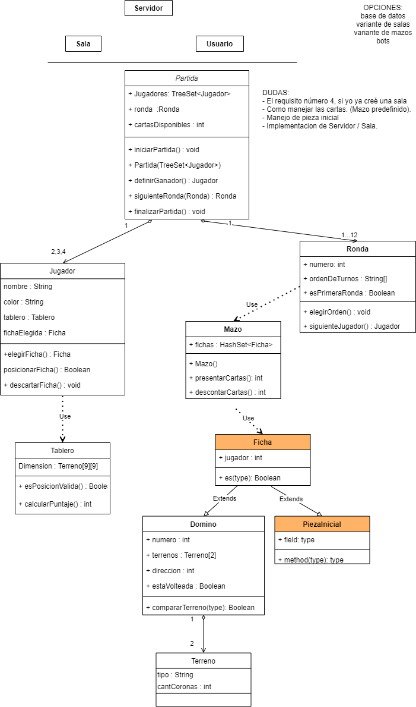

# Kingdomino

## Introducción

Se trata de un proyecto para el taller de calificación profesional de la materia
*programación avanzada* de la **Universidad de la Matanza**. [Kingdomino][1] es un
juego por turnos el cual hace base en el domino. En este proyecto se busca crear una versión del
mismo en Java.  

Se pueden encontrar las consignas [aquí][2]

## Actual diagrama de clases

## Qué hacer

Para ver el actual estado de desarrollo, visitar el [Trello][3]

[1]: https://www.blueorangegames.com/administrator/components/com_bogames/files/rules/cfa0f38157341a002eab1100aab478ea-Kingdomino-Rules-US-2nd-Edition.pdf
[2]: https://github.com/programacion-avanzada/2021a/blob/main/consigna
[3]: https://trello.com/b/DgjtWtge/kingdomino
